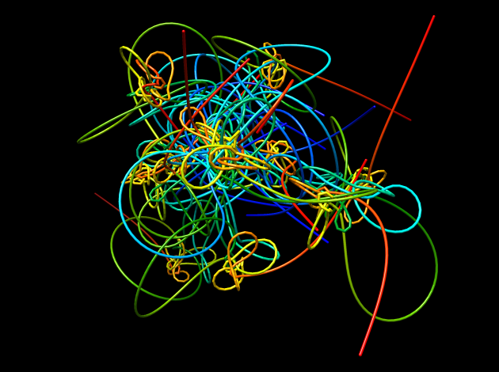
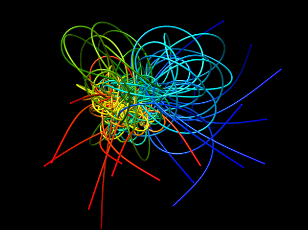

Chimera match
=============

Chimera script for superimposing set of structure using `match` command (i.e. Kabsh algorithm).

#### Usage
All structures must be in the separate PDB file in single directory. They all must have the same number of atoms. This script must be run inside UCSF Chimera.

~~~
chimera --nogui --script "~/bin/misc/chimera_match.py /absolute/path/with/trailing/slash/"
~~~
#### Before

#### After
